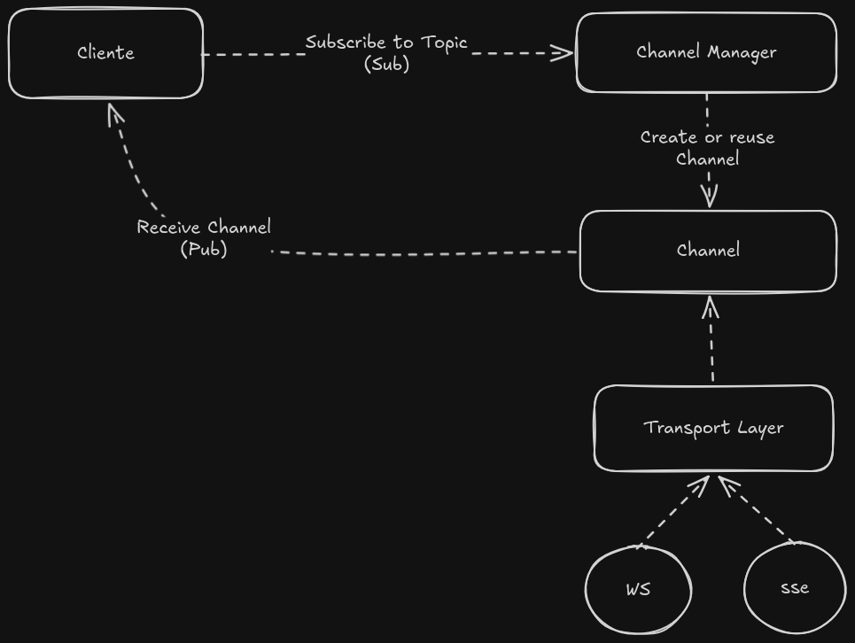

# Gossip

Gossip is a Go library that provides a simple and efficient way to implement real-time communication between clients and servers using WebSockets and Server-Sent Events (SSE). It abstracts away the complexities of managing connections and allows developers to focus on building their applications.

